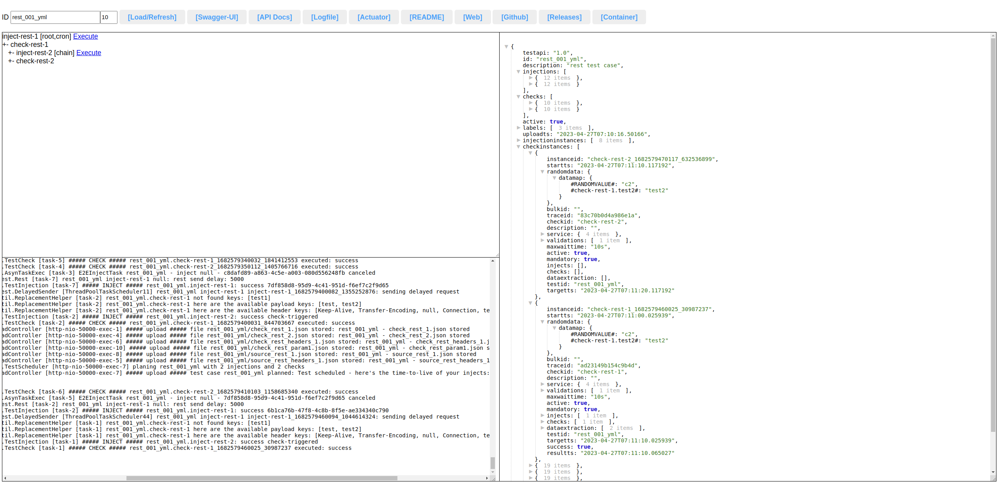
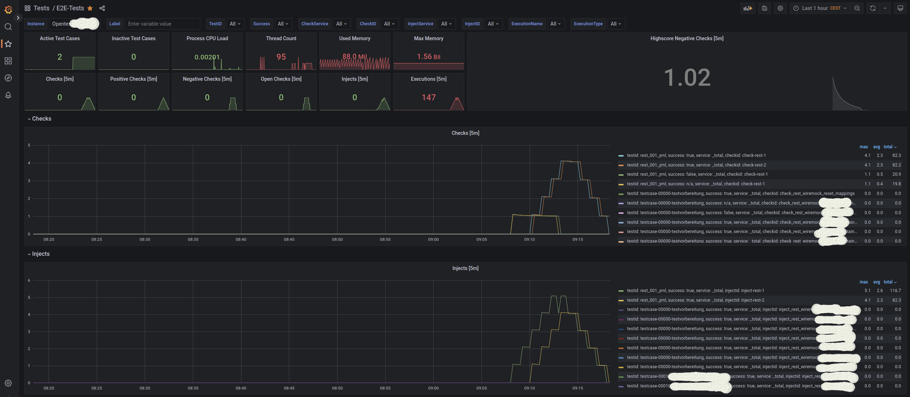
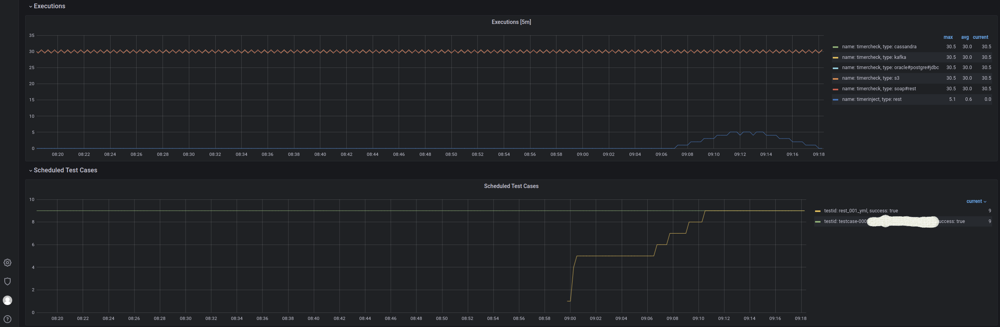

# open testing implementation spring boot

Reference implementation to upload test cases, create random data and perform tests cron triggered

API: https://opentestingapi.github.io/specification/version-1.1/

Container:   https://github.com/opentestingapi/impl_java/pkgs/container/opentesting

Changelog: [CHANGELOG](CHANGELOG.md)

## Architecture


## GUI



test case: https://github.com/opentestingapi/impl_java/tree/master/src/test/resources/opentesting/systemtests/rest_001_yml

## Grafana




## Java and Spring Boot?

We would like to make it as easy as possible to extend and to fork the project, so we used commonly used technologies.


## Functions

* INJECT - insert data (default timetolive = 1 day)
* CHECK - check data
* CHECK could have subsequent INJECTS/CHECKS (API extension)
* please use labels to enable label search
* random data generation
* available time definitions: s=second, m=minute, h=hour, d=day
* Container usage preferred


## How to upload a test case?

Let's take an example with an input file and the test case:
* myfile1.txt
* test1.json

Here are the commands to upload them (please use --data-binary if you want to keep new lines):
```
curl -X POST "http://localhost:50000/upload/file/<testid>/myfile1.txt" -H "accept: */*" -H "Content-Type: text/plain" --data-binary @myfile1.txt && echo
curl -X POST "http://localhost:50000/upload/test" -H "accept: */*" -H "Content-Type: application/json" --data-binary @test1.json && echo
```

Injects could be triggered by:
* cron configuration within test case
* using our GUI (http://localhost:50000/)
* using the API endpoints


### Environemt Templating (script based)

[environment_templating](scripts/environment_templating/)

### Use Includes for JSON/YML (script based)

[testcase_include](scripts/testcase_include/)


## Examples

[Hello World](src/test/resources/opentesting/other/local_test_helloworld.json)

[Complex Example](src/test/resources/opentesting/other/local_test_00001/test.json)

test cases from the implementation itself:

[Systemtests](src/test/resources/opentesting/systemtests/) - used for automatic adapter testing (1 technology used only)

generic test case example:

[Template](src/main/resources/templates/templatetest.json)

<http://servername:50000/template/testcase>


## Adapters

the following adapters could be used:

| type          | readme  |
| ------------- | ------- | 
| cassandra     | [ReadMe](src/main/java/org/opentesting/services/adapter/cassandra/README.md) |
| kafka         | [ReadMe](src/main/java/org/opentesting/services/adapter/kafka/README.md) |
| jdbc          | [ReadMe](src/main/java/org/opentesting/services/adapter/jdbc/README.md) |
| rest/soap     | [ReadMe](src/main/java/org/opentesting/services/adapter/rest/README.md) |
| S3            | [ReadMe](src/main/java/org/opentesting/services/adapter/s3/README.md) |


## Random Data / Replacements

* we fully support API replacements: https://opentestingapi.github.io/specification/version-1.1/#replacement-object
* result and header (only JSON!) from checks/injects could be added to random data using attribute: dataextraction (API extension - be careful with usage before kafka checks, often messages are created earlier than the check has access to result to random value)
* subsequent checks/injects will be executed if non-mandatory checks failed, for mandatory failed ones whey will not be executed
  
Using the last feature it is possible to extend the available (random) data with additional data,
as this is transferred into subsequent injects and checks.
(property 'target' could be used to define key in data pool and 'regex' to use only parts of the data)

* dataextraction example including subsequent checks and injects
```
{
        "checkid" : "check-rest-1",  
        "active" : true,
        "service" : {...},
        "validations": [...],          
        "maxwaittime" : "10m",
        "mandatory" : false,
        "injects" : [ "inject-rest-2" ],
        "checks" : [ "check-rest-2" ],
        "dataextraction": [ 
            {
                "attribute": "test",
                "source": "payload",
                "target": "#check-rest-1.test#"
            },{
                "attribute": "testheader",
                "source": "header",
                "target": "#check-rest-1.testheader#",
                "regex": ".*test"
            }
        ]
}
```


## Naming Rules / Storage

IDs must be unique, please create a guideline for your test case creators.

* Tests for 1 application should be stored next to it
* Tests for 1 department should be stored in a department repository
* Tests for 1 project should be stored in a project repository
* ...

Please think about using a kind of folder structure to differ between functional cases.


## API Usage

Swagger-UI: http://servername:50000/swagger-ui/api-docs.html


1. upload required files first (please use application/json for all file types): 
```
curl -X POST "http://<servername>:50000/upload/file/<testcaseid>/<filename>" -H "accept: */*" -H "Content-Type: application/json" -d @<filename> && echo
```


2. upload test case as JSON:
```
curl -X POST "http://<servername>:50000/upload/test" -H "accept: */*" -H "Content-Type: application/json" -d @<filename> && echo
```


* remove test case
```
curl --request DELETE --url http://<servername>:50000/upload/test/<testcaseid>
```

* read test case
```
curl --request GET --url 'http://<servername>:50000/reporting/test/<testcaseid>?lastchecks=100'
```

* read file
```
curl --request GET --url http://<servername>:50000/reporting/file/<testcaseid>/<filename>
```

* search test case (read all with /reporting/search?labels=%25)
```
curl --request GET --url 'http://<servername>:50000/reporting/search?labels=<yourlabel>&lastchecks=100'
```

* list injects to trigger manually (must be activated)
```
curl --request GET --url 'http://<servername>:50000/trigger/'
```

* trigger inject (must be activated)
```
curl --request GET --url 'http://<servername>:50000/trigger/inject/<testcaseid>/<injectid>'
```

* trigger data generation (inject must be activated)
```
curl -X POST "http://servername:50000/trigger/datagenerator" -H "accept: application/json" -H "Content-Type: application/json" -d "{\"testId\":\"string\",\"injectId\":\"string\",\"count\":0}"
```

* read filtered log files
```
curl --request GET --url 'http://<servername>:50000/reporting/log?filter=<yourfilter>&maxage=7'
```

* pause injects and checks
```
curl --request GET --url 'http://<servername>:50000/trigger/pause/<true/false>'
```


## Pipeline Integration / Bulk Execution

You can use this endpoints to realize a pipeline integration.

* bulk execute injects
```
curl -X POST "http://<servername>:50000/trigger/bulk/" -H "accept: application/json" -H "Content-Type: application/json" -d "[\"<testcaseid>.<injectid>\",\"<testcaseid>.*\"]"
```

* bulk read check results
```
curl -X GET "http://<servername>:50000/reporting/bulk?bulkid=<bulkid>" -H "accept: application/json"

```

Here you can find our JUnit integration example: https://github.com/opentestingapi/impl_java_testcontainers


## Password Encryption

Simply use this endpoint to encrypt your passwords and use in your testcase:

(need to be decrypted within the tool for later usage, hash usage does not fit our use case - salt in properties is used to increase security)

```
curl --request POST -H "Content-Type: text/plain; charset=utf-8" --url http://<servername>:50000/password/encrypt --data 'HalloWelt!123'
```

```
curl --request POST -H "Content-Type: text/plain; charset=utf-8" --url http://<servername>:50000/password/decrypt --data 'ENC(e8K7wp7CusOAwpzCrMOBw5ltwpl6woQ=)'
```


## Development Environment

Local development environment could be started running a simple Java main method (powered by Testcontainers).

https://github.com/opentestingapi/impl_java/tree/master/src/test/java/org/opentesting/devenv#development-environment


### Build (JDK 11)

Local build:

```
./build.sh
```

Local build and Run (please start local environment PostGre or configure H2):

```
./run.sh
```

Local build and Container creation could be done using the Dockerfile.


## Container Usage / Environment Variables

You should run this tool as a container (maybe with network host if you want to test local services):

local (it might be a good idea to use --net=host locally instead of -p to access ressources with 'localhost')
```
docker run -d -p 50000:50000 --name=opentesting --restart=always ghcr.io/opentestingapi/opentesting:latest
```

server with 2 GB RAM and 2 cores
```
docker run -d -p 50000:50000 --name=opentesting --restart=always -m 2g --cpus="2" -e "JAVA_TOOL_OPTIONS=-XX:MaxRAMPercentage=75.0" ghcr.io/opentestingapi/opentesting:latest
```

use external PostGre instead of internal H2 database
```
docker run -d -p 50000:50000 --name=opentesting --restart=always -m 2g --cpus="2" \
    -e "JAVA_TOOL_OPTIONS=-XX:MaxRAMPercentage=75.0" \
    -e "SPRING_DATASOURCE_DRIVER_CLASS_NAME=org.postgresql.Driver" \
    -e "SPRING_DATASOURCE_USERNAME=<user>" \
    -e "SPRING_DATASOURCE_PASSWORD=<password>" \
    -e "SPRING_DATASOURCE_URL=jdbc:postgresql://<servername>:<port>/<databasename>" \
    ghcr.io/opentestingapi/opentesting:latest
```

integrate with Sleuth / Zipkin Tracing (default sampling rate 0.0)
```
docker run -d -p 50000:50000 --name=opentesting --restart=always -m 2g --cpus="2" \
    -e "JAVA_TOOL_OPTIONS=-XX:MaxRAMPercentage=75.0" \
    -e "SPRING_SLEUTH_SAMPLER_PERCENTAGE=1.0" \
    -e "SPRING_ZIPKIN_BASEURL=<zipkinserver>" \
    ghcr.io/opentestingapi/opentesting:latest
```

### Parameters (can be used similar to SPRING_DATASOURCE_USERNAME)

|Parameter   |Default   |Description   |
|---|---|---|
|OPENTESTING_APPNAME   |opentesting  |application name   |
|OPENTESTING_AUTODELETE   |7   |delete checks older than 7 days (targetts)   |
|OPENTESTING_CHECKCRON   |[ "0 * * * * ?", "10 * * * * ?", "20 * * * * ?", "30 * * * * ?", "40 * * * * ?", "50 * * * * ?"]   |cron for check execution   |
|OPENTESTING_DOWNLOADMAXCHECKS   |1000   |maximum allowed download size for checks   |
|OPENTESTING_LONGRUNNINGWARN   |5   |warning if process takes more than 5 sec   |
|OPENTESTING_POOLSIZE   |50   |internal thread pool size   |
|OPENTESTING_RELOADTESTCASES   |true   |reload database testcases after container restart   |
|OPENTESTING_RESTTIMEOUT   |30   |timeout for HTTP(S) request, for example JWT receiver   |
|OPENTESTING_SALT   |   |instance specific salt for password encryption   |
|OPENTESTING_USELOCK   |true   |use a cache to avoid user locks because of wrong credentials   |


## Utilities

Grafana Dashboard:

[Dashboard](src/main/resources/templates/OpenTesting-Dashboard.json)

<http://servername:50000/template/dashboard>

Swagger:

<http://servername:50000/swagger-ui/>

Dashboard / Info / Metrics / Log / everything else:

<http://servername:50000/>
